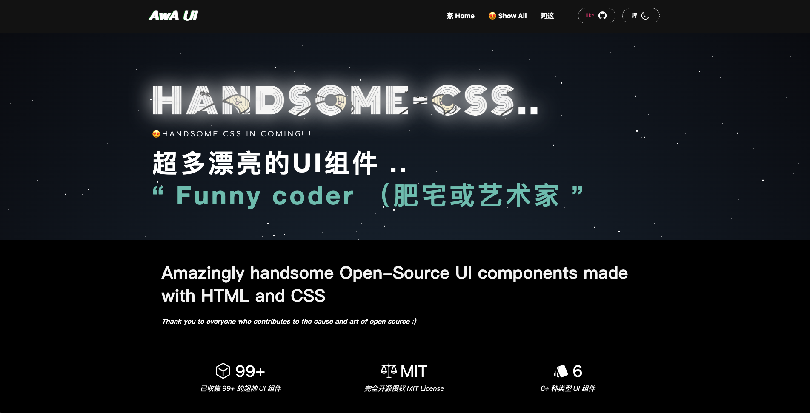
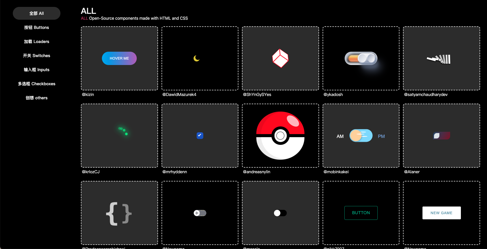
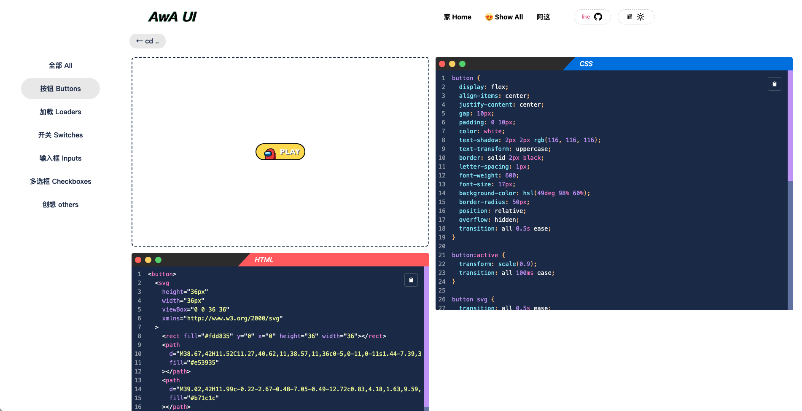

<div align="center">
    <h1>
        ✨ AWA UI
    </h1>
    <a href="https://github.com/ZiYi0414/handsome-css3-lib">
        
    </a>
    
    
    <p>You dont need JS. 😄</p>
</div>

## Handsome-css3-lib
Amazingly handsome Open-Source UI components made with HTML and CSS

Thank you to everyone who contributes to the cause and art of open source :)

- 网站主旨在于收集网上仅靠 CSS 与 HTML 就可以实现的动效UI。

- 目的是为了提高开发者的审美和技术。

- 有兴趣的小伙伴可以通过  <a href="https://github.com/ZiYi0414/handsome-css3-lib/issues"></a> 联系我，一起维护这个平台。

- 虽然内容全部完全开源，但尽可能的标注了每个组件的作者名称。


## 如何构建 / How to build
First, run the development server:

> node -v : node >= 16

```bash
npm run build
npm run dev
# or
yarn build
yarn dev
```
Open [http://localhost:8204](http://localhost:8204) with your browser to see the result.


## TODO:

- ~~主页展示方式更新。  p0    DL: 2023-02-28~~
- 需要解决数据逐渐变大的问题。 p1   DL: 2023-03-20
- 单页dom过多解决渲染性能问题。 p1  DL: 2023-03-20
- 账号系统。 p2
- 创作模块。 p3
- CSS Challenge 主题挑战 p3
- 自定义组件模块, 拖拽数值, 自定义颜色, 自定义特效和组合。 p3


## 预览

### web 主页


### web 分类


### web 详情


## 编写手册
[详情请查看](https://github.com/CFsjp/chengfeng-blog/issues/3)

